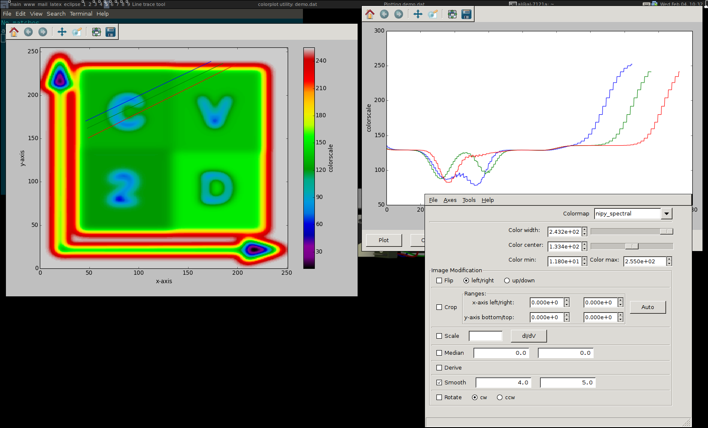

I developed `colorview2d` during my PhD to easily plot and prepare 3D data sets from measurements
for a first screening. Being able to quickly play with colorscales and ranges, apply filters and
extract arrays of linecuts is very useful to extract important features early on during a measurment.

The initial version supplied a [wxPython](https://www.wxpython.org/) GUI but it turned out that
the integration of GUI and logic was a bad idea. I removed the GUI from the package at some point
with the aim to provide a separate package for the GUI. I never did.

The version available on [sourceforge](https://sourceforge.net/projects/colorview2d/) still provides
the GUI and even ships a Windows (7!) binary.

