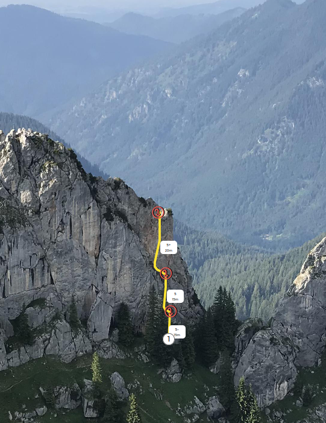

[cruxle.org](https://cruxle.org) is a database for climbing metadata and climbing topos
presented as overlays on real zoomable wall photographs.

It is the wikipedia idea applied to topos and climbing information. Everything can be edited by everyone - no paywalls.

You can search for climbing topos via an intuitive map view or via text search and you can contribute by uploading new topos or adding routes and descriptions to existing ones (all changes to objects are in version control).

This was my first serious web project.
The cool thing about this page is the integration of the leaflet library to be able to use huge
wall panorama images with high resolution in a responsive way
(i.e., zoom in, dynamic display of overlays etc) without time consuming image downloads.

### Architecture

All services reside in Docker containers. In the backend we use Django, for the frontend
we rely on Javascript/jQuery and occasionally vue.js.
Large wall panoramas can be *stitched* together from single images using
[hugin](https://hugin.sourceforge.io/) on a dedictated Celery worker.
