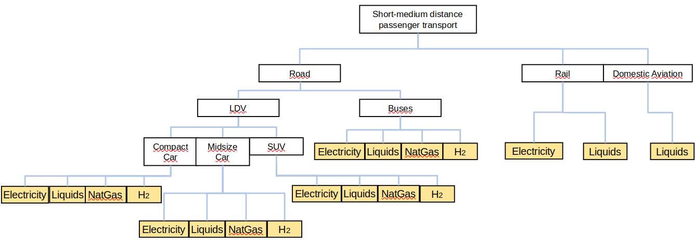

The EDGE-Transport model is a energy-systems research vehicle to provide 
scenarios for transportation demands for 21 world regions in the timeframe 2005 - 2100.
Starting from a fork of the [GCAM transport module](https://jgcri.github.io/gcam-doc/energy.html#transportation) I joined [Marianna Rottoli](https://github.com/MariannaR) in 2019 for a full refactoring. 

Although originally an independent piece of software, it got tied to the energy system
model REMIND as it uses the REMIND input data toolchain to start from a coherent set of 
techno-economic variables. It is mainly written in R and we relied heavily on the convenient
`data.table` package to do the data juggling.

A more detailed description is beyond the scope of this page, details can be found in [Rottoli et al.](https://link.springer.com/article/10.1007/s10666-021-09760-y).

Roughly speaking, the model relies on a decision tree such as the following:

Global real-world transportation data is used to calibrate the decision parameters.
Adding a wealth of assumptions on future cost markups and consumer preferences, the model provides 
energy service demands for freight and passenger transportation.

